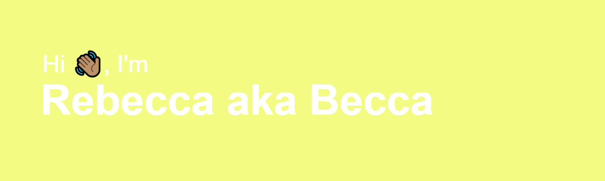

<h2 align="center">Aspiring frontend developer from Virginia</h2>

<h3 align="left">Little Bit About Myself:</h3>

I have an older brother, named Matthew. He and I were born and adopted from Vietnam. I have hemiparesis cerebral palsy on my right side.  

<h3 align="left">How I got Started in Web Development?</h3>

I started learning about web development after not been satified doing accounting certificate. I had no frontend experience until I watched YouTube tutorials on building responsive websites using HTML, CSS, and JavaScript. The only way to improve is building projects. I am fan of philosophy called Stoicism. The quote below is great reminder for everyone that working on things one day at a time. 

<h3 align="left">Stoic quote ⏬</h3>

“Progress is not achieved by luck or accident, but by working on yourself daily.” - Epictetus

-  📚 I will graduate this upcoming Spring 2023 semester at Brightpoint Community College with a Computer Programming certificate. 

- 🔭 I’m currently working on [Frontend Mentor projects](https://www.frontendmentor.io/profile/bccpadge) and other  projects on Youtube as well. 

- 🌱 I’m currently learning **HTML, CSS, and JavaScript.**

- ⚡ Fun fact **I watch way too many Hallmark movies. 🍿**

<h3 align="left"> 🛠 Languages and Tools I use ⏬</h3>

